# Normal-Protocol Loss3 Experiment 4 Ray Profile Result - 2026-05-16

Status: GPU run completed for FNO / 1D Burgers `nu=0.001`, batch size 100.

## Final One-Figure Conclusion

The strongest conclusion from this corrected Ray experiment is:

```text
Directions that are locally fastest near the clean point do not necessarily remain strongest after following the same straight ray to the finite radius r=8.
Local optimality and finite-radius endpoint optimality are different.
```

If only one figure is used to summarize the experiment, use this one:

```text
/workspace/NeuralOperatorRobustness2/forensics/loss3_ray_profile_pgd_20260516/fno_nu0p001_gpu_v100_batch100_steps100_zero_fixedsign/figures/normal_batch100_all_metrics_by_direction_full_r_grid.png
```

This figure plots the fixed-ray profiles for multiple directions. For each direction `v`, it evaluates:

```text
x(r) = x + r v
```

and shows how `loss1`, `loss2`, `loss3`, and the ratio diagnostics change as `r` increases.

Key data support:

| direction | local diagnostic result | endpoint `loss3` at `r=8` | endpoint wins |
| --- | --- | ---: | ---: |
| `local_outward_growth` | small norm-growth wins `100/100` | 2.720 | 0/100 |
| `local_residual_movement` | small residual-increment wins `100/100` | 4.139 | 31/100 |
| `loss3_original_final` | small local wins `0/100` | 5.447 | 58/100 among all directions |
| `loss3_original_final` among finite attack objectives | direct `loss3` PGD attack | 5.447 | 81/100 among the three finite attack objectives |

Interpretation by direction:

- `local_outward_growth`: locally maximizes residual norm growth, but is weak at the finite endpoint.
- `local_residual_movement`: locally maximizes residual field movement and transfers better than `local_outward_growth`, but is still not the overall finite-radius winner.
- `loss3_original_final`: is not the fastest local direction, but is the strongest endpoint `loss3` direction at `r=8`.

Therefore this experiment provides direct evidence for the nonlinear local-to-global gap: the local direction is genuinely locally strong, but the endpoint winner changes as the ray moves far from the clean point.

## Important Protocol Note

This run intentionally does not use best-over-steps and does not use multi-restart selection. Each attack objective uses one initialization, runs `pgd` to the final step, and the final direction is the ray direction.


## Correction And Cross-Check

This result supersedes the earlier non-fixed-sign PGD Ray wrapper output in `docs/loss3_ray_profile_pgd_fno_nu0p001_gpu_batch100_steps100_result_20260516.md`. That earlier wrapper had a manual-PGD sign error: it backpropagated `-objective` and then updated `delta += alpha * grad`, which is descent for the target objective. Adam did not have this sign issue because Adam minimizes the negative objective internally.

The corrected wrapper now matches the historical PGD convention in `tools/run_batch_three_loss_loss_only.py`: backpropagate the objective itself and update `delta += alpha * grad`, followed by projection to the L2 epsilon ball.

A direct historical-script cross-check was also run with `batch_size=100`, `epsilon=8`, `alpha=0.3`, `steps=100`, `zero` initialization, `PGD`, FNO, Burgers `nu=0.001`, and CUDA. It reproduced the old conclusion:

| PGD objective | final delta norm mean | boundary loss3 mean |
| --- | ---: | ---: |
| `loss3_original_pgd` | 7.7510 | 5.4469 |
| `loss3_increment_ratio_pgd` | 7.8505 | 4.2215 |
| `loss3_regularized_pgd` | 0.3043 final, rescaled to 8.0 for boundary diagnostic | 2.0275 |

Therefore the discrepancy was not caused by sample randomness. It was caused by the Ray wrapper's manual-PGD sign bug, plus the fact that the earlier Adam/local-init normal run was not the same protocol as the historical PGD run.

Under the corrected Ray PGD100 protocol, comparing only the three finite-radius PGD attack objectives by the same endpoint `loss3_original` metric gives winner counts: `loss3_original_final` 81/100, `loss3_increment_ratio_final` 15/100, and `loss3_regularized_final` 4/100. Including the two clean local diagnostic directions, `loss3_original_final` still has the largest mean endpoint loss3, while `local_outward_growth` and `local_residual_movement` remain the clean small-radius winners.

## Scope And Settings

- Samples: `[0, 1, 2, 3, 4, 5, 6, 7, 8, 9, 10, 11, 12, 13, 14, 15, 16, 17, 18, 19, 20, 21, 22, 23, 24, 25, 26, 27, 28, 29, 30, 31, 32, 33, 34, 35, 36, 37, 38, 39, 40, 41, 42, 43, 44, 45, 46, 47, 48, 49, 50, 51, 52, 53, 54, 55, 56, 57, 58, 59, 60, 61, 62, 63, 64, 65, 66, 67, 68, 69, 70, 71, 72, 73, 74, 75, 76, 77, 78, 79, 80, 81, 82, 83, 84, 85, 86, 87, 88, 89, 90, 91, 92, 93, 94, 95, 96, 97, 98, 99]`.
- Epsilon: `8.0`.
- Attack optimizer: `pgd`.
- Attack initialization: `zero`.
- Attack steps: `100`.
- Attack learning rate / PGD alpha: `0.3`.
- Output directory: `forensics/loss3_ray_profile_pgd_20260516/fno_nu0p001_gpu_v100_batch100_steps100_zero_fixedsign`.
- Runtime device: `Tesla V100-SXM2-32GB`.
- Runtime seconds: `443.6`.

## Winner Counts

- Best endpoint `loss3` at `r=epsilon`: `{'loss3_original_final': 58, 'local_residual_movement': 31, 'loss3_increment_ratio_final': 10, 'loss3_regularized_final': 1}`.
- Best small-radius clean residual norm-growth ratio: `{'local_outward_growth': 100}`.
- Best small-radius residual-increment ratio: `{'local_residual_movement': 100}`.

## Aggregate Direction Table

| direction | endpoint mean | endpoint wins | small growth mean | small growth wins | small residual-ratio mean | small residual wins |
| --- | --- | --- | --- | --- | --- | --- |
| original-final | 5.447 | 58 | 0.1461 | 0 | 0.6226 | 0 |
| inc-ratio-final | 4.221 | 10 | 0.2317 | 0 | 0.6005 | 0 |
| local-residual | 4.139 | 31 | 0.0121 | 0 | 1.101 | 100 |
| local-outward | 2.720 | 0 | 0.2414 | 100 | 0.5311 | 0 |
| regularized-final | 2.068 | 1 | 0.0827 | 0 | 0.4542 | 0 |
| random | 0.5268 | 0 | -0.00099 | 0 | 0.0462 | 0 |
| resid-ratio-final | 0.2976 | 0 | 0 | 0 | 0 | 0 |

## Local-To-Global Gap Summary

| quantity | mean | std | min | max |
| --- | --- | --- | --- | --- |
| endpoint_over_small_growth_endpoint_loss3 | 3.124 | 1.960 | 1.130 | 12.15 |
| endpoint_over_small_residual_endpoint_loss3 | 2.716 | 4.144 | 1.000 | 25.01 |

Interpretation: values larger than 1 mean the endpoint winner has larger `loss3` at `r=8` than the direction that won the corresponding small-radius diagnostic. This is the direct ray-profile evidence for local-to-global mismatch.

## Artifacts

- `ray_profile.csv`: every sample, direction, and radius.
- `ray_profile_aggregate_curves.csv`: mean curves for all losses/ratios.
- `ray_direction_summary.csv`: endpoint and small-radius summaries per sample/direction.
- `ray_direction_aggregate.csv`: aggregate ranks and winner counts.
- `ray_winner_summary.csv`: per-sample winners.
- `local_to_global_gap_summary.csv`: per-sample comparison of local winners against endpoint winner.
- `attack_trace.csv`: final-step single-init attack traces.
- `attack_final_by_sample.csv`: final attack values per sample.
- `manifest.json`: GPU/runtime metadata.

## Visualizations


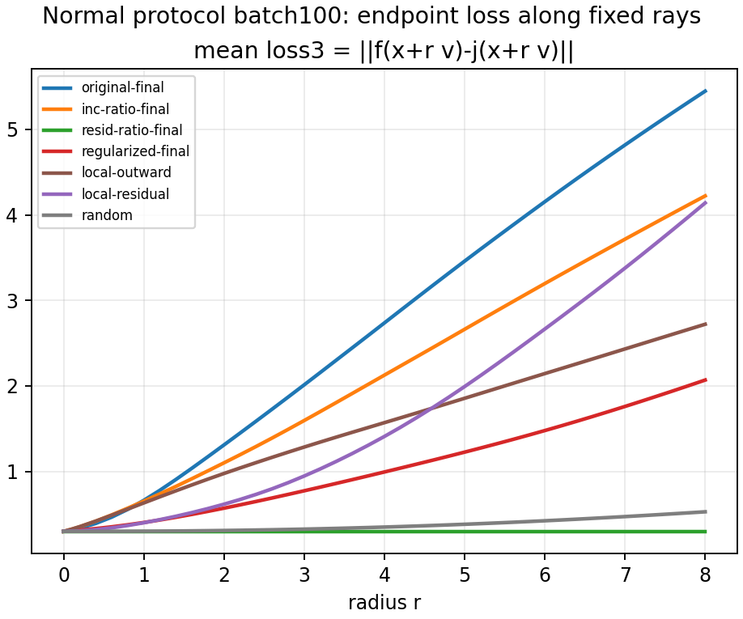

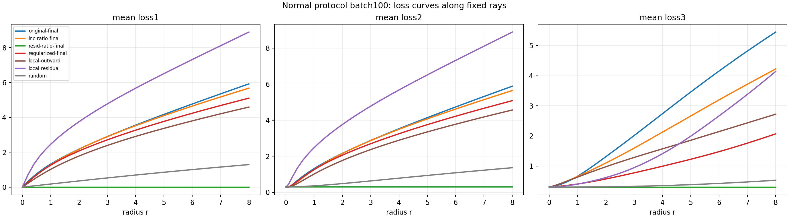

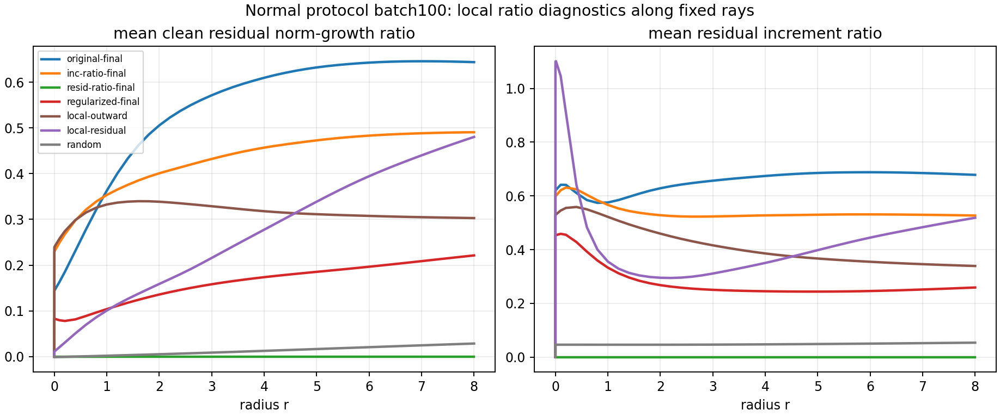

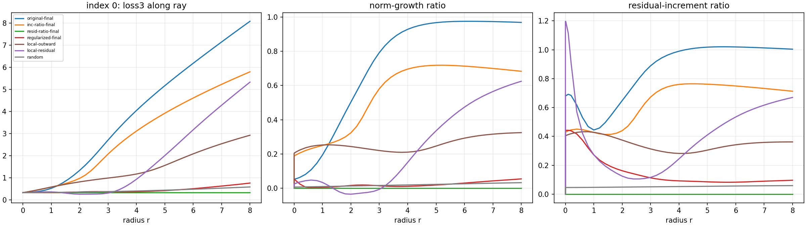

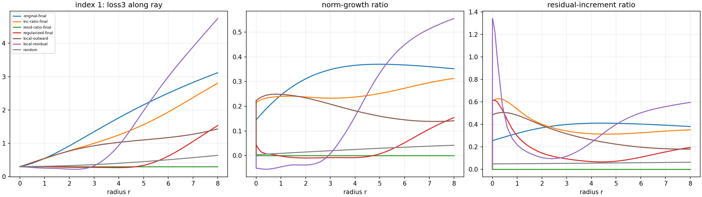

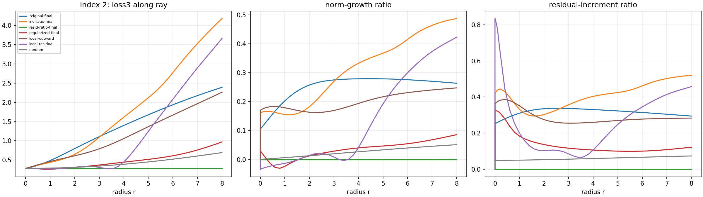

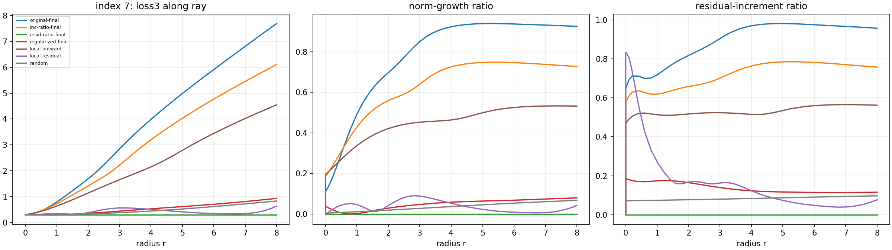

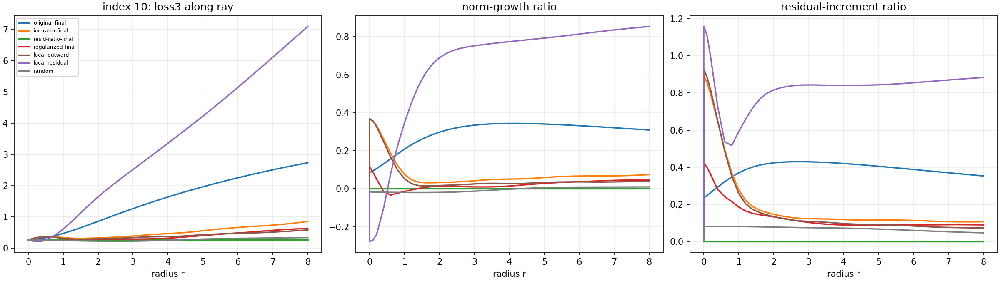

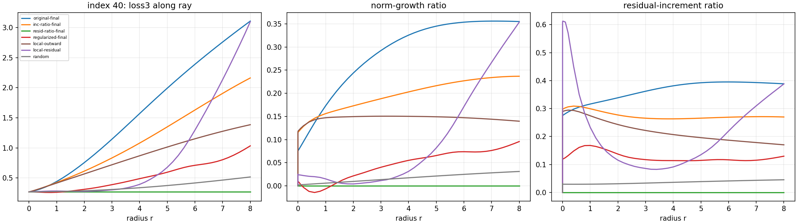

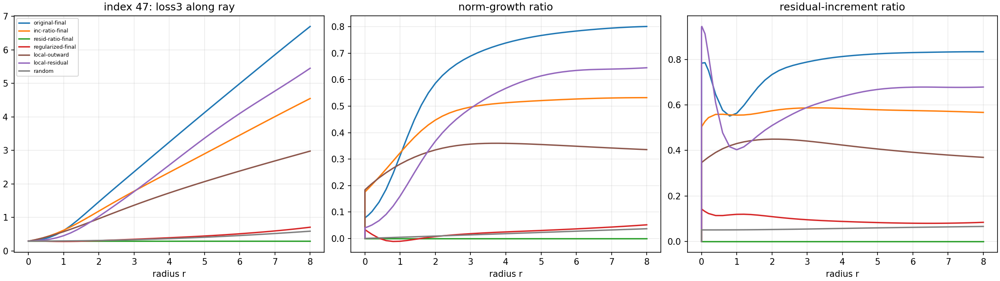

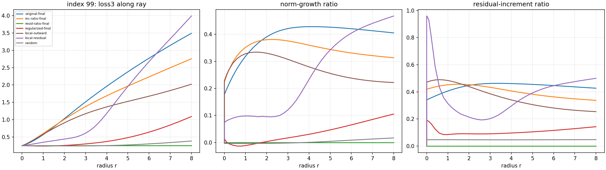

